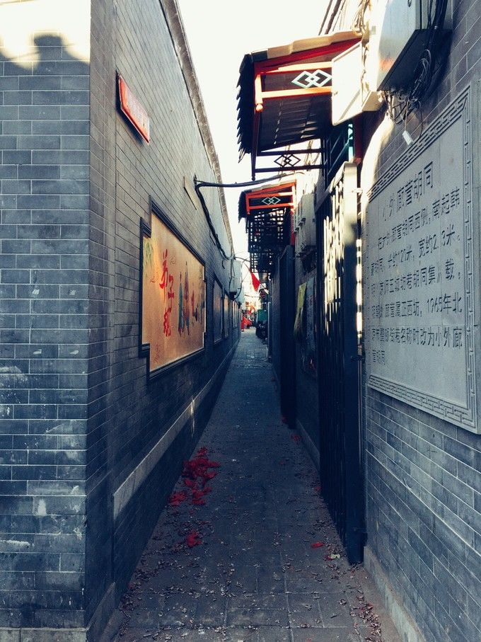
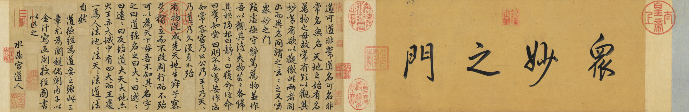

# 北京
## 胡同
北京有上千条胡同。有： “有名儿的胡同三千六，沒名儿的胡同賽牛毛” 的说法。

### 南锣鼓巷
南锣鼓巷是北京最古老的街区之一。它于元大都(1267年)同期建成，是我国唯一完整保存着元代胡同院落肌理、规模最大、品级最高、资源最丰富的棋盘式传统民居区。

现为北京市著名商业街。风格百变的个性店铺，精巧时尚的私房小馆。

### 八大胡同
八大胡同曾经是 “烟花柳巷” 的代名词。八条胡同的统称。在西珠市口大街以北、铁树斜街以南，由西往东依次为：百顺胡同、胭脂胡同、韩家潭、陕西巷、石头胡同、王广福斜街、朱家胡同、李纱帽胡同。

老北京人所说的“八大胡同”，并不专指这八条街巷，而是泛指前门外大栅栏一带，因为在这八条街巷之外的胡同里，还分布着近百家大小妓院。

八大胡同的沧桑岁月也见证了满清末年列强入侵的暴行和民国初年政权物换星移的悲哀。在这段令人心酸的历史过程里，八大胡同也曾出现过感人肺腑的轶事和感情。状元夫人赛金花的传奇故事和青楼女子小凤仙与云南都督蔡锷将军的一段情都发生在这里。

### 推荐阅读
[北京最值得一去的15个胡同！特色胡同推荐！](https://zhuanlan.zhihu.com/p/35265219)

## [故宫博物馆](https://www.dpm.org.cn/Home.html)
### 千里江山图

### 赵孟頫书道德经三章卷

## 长城

## 炸酱面
