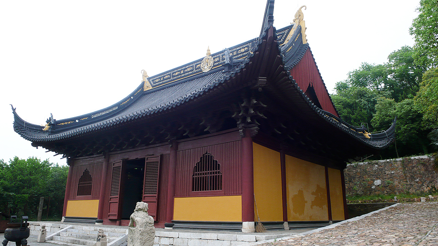

# 苏州
适居。水乡，鱼米之乡。制造业。

## 水
太湖三白。白鱼，白虾，银鱼。

水八仙。

莼菜。

大闸蟹。

响鱼鳝糊。

松鼠鳜鱼。

## 甜食
糯米糕点：定胜糕，薄荷糕，五色糕，梅花糕。黄天源。

松花团子，青团子。

粽子糖，酥糖。 采芝斋。

## 园林
野外于城市的结合。大隐隐于市。

拙政园。

虎丘。

## 商业街
山塘街

## 山丘
一堆小山丘。穹窿山，灵岩山，天平山，树山，大阳山。

大阳山的绝望坡。以路陡出名。

灵白线，鱼肠线。

飘渺峰

## 博物馆
### 苏州博物馆

## 塔
瑞光塔

北寺塔

双塔

## 城门
6个城门。

盘门

## 建筑
### 忠王府

### 轩辕宫
> 道教古迹。位于东山杨湾村。创建于唐贞观二年(628)，初为祭祀吴国大臣伍子胥之所，故称胥王庙，后改为汉祠，正殿供奉轩辕黄帝塑像，取名轩辕宫。

轩辕宫正殿是苏州市年代最为久远的木结构古建筑之一。

## 其他
丁香巷 - 《雨巷》

